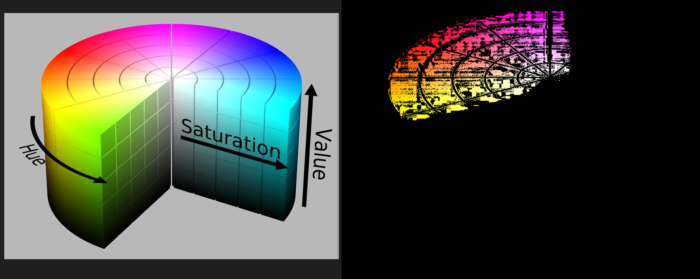

  <h1>불법주차 차량 단속 노파크</h1>

## 🧾목차

1. [**서비스 소개**](#-서비스-소개)
2. [**기술 스택**](#%EF%B8%8F-기술-스택)
3. [**시스템 아키텍처**](#-시스템-아키텍쳐)
4. [**주요기능 및 데모영상**](#-주요기능-및-데모영상)
5. [**차량 주요 센서**](#-차량-주요-센서)
6. [**UCC 보러가기**](#-ucc-보러가기)
7. [**개발 멤버 소개**](#-개발-멤버-소개)
8. [**프로젝트 기간**](#-프로젝트-기간)

## ✨ 서비스 소개

#### 매년 증가하고 있는 불법주차

> 불법 주정차 관련 사고는 매년 증가하고 있습니다.
>
> 그에 따른 관련 민원은 2014년 3만건에 202년 314만건으로 급격히 증가하고 있습니다.
>
> 이를 해결하고자 불법주차단속에 공무원들이 동원되어 업무에 차질이 발생하는 등 불법주정차로 인한 피해가 늘어나고 있습니다.

#### 불법주정차의 해결책 NOPARK  :police_car:

##### 불법주정차로 인해 운전하시기 많이 불편하셨죠? 저희 노파크가 앞장서 안전하고 깨끗한 도로를 만들어보겠습니다!

## 🛠️ 기술 스택

 

## 🎛 시스템 아키텍쳐

#### ERD

##  :police_car: 주요기능 및 데모영상

### 1. 자율주행

- 반복적인 경로를 사람인 운행하는 것은 인력 낭비라고 생각하여 정밀지도화 된 도로를 바탕으로 시스템이 운행하는 자율주행을 이용하였습니다.

#### 자율주행 판단 및 제어 기능
- 최적 경로

	
	
	- 출발점과 도착점까지의 최적의 경로를 생성하는 방법입니다. 
	
	- dijkstra 알고리즘을 이용하여 노드 간의 거리를 바탕으로 출발점으로 부터 도착점까지의 거		리가 가장 짧은 최적의 경로를 설정합니다. 
	
	  
	
- 차선 추종

	
	
	
	
	- 인지된 차선을 올바르게 따라가게 하는 방법입니다.
	- purepursuit 알고리즘을 이용하여 차선을 추종합니다. 이 때 전방 주시 거리(어느정도 전방	을 바라보면서 주행할건지)를 바탕으로 전방의 목표 점을 찾아 그 점을 기준으로 핸들의 조향각을 설정합니다. 
	
- 속도제어

	
	
	- 원하는 값에 도달하기 위한 자동 피드백 제어 방법입니다.
	- PID 제어를 이용하여 속도를 유지할 수 있게 해줍니다. 비례향, 오차항, 적분항을 이용해 제어에 필요한 제어값을 구해주어 속도를 유지합니다.
	
- 경로 기반 속도 제어

	
	
	- 경로에서 얼마만큼의 속도를 내는가를 계획하는 방법입니다.
	- 직선에서는 빠른 속도로 주행하지만 곡선에서는 빠른 속도로 주행할 수 없습니다. 이때 곡선에서 낼 수 있는 최대속도를 구해주어 속도를 제어합니다.
	
- ACC (Adaptive Cruise Control)

  

  - 운전자가 설정한 속도로 주행하다가 앞 차와의 일정한 간격을 유지하는 시스템입니다.
  - 상대거리가 안전거리보다 크면 속도 유지해 주고 안저거리 보다 작으면 속도를 줄여주면서 앞 차와의 간격을 유지합니다.

__속도제어, 경로 기반 속도 제어, ACC 를 이용하여 차선 추종 알고리즘을 발전시킵니다__ 

#### 자율주행 인지 기능
__1. 카메라 센서__

- Region of Interest

	
	- ROI ( Region of Interest) : 관심밖의 영역을 잘라내고 필요한 부분의 영역(차선)만 볼 수 있는 영상처리를 구현합니다. (본 영상에서는 [0, 350], [280, 200], [360, 200], [640, 350] 의영역을 처리) 
- Hue Saturation Value

	
	- RGB —> HSV 
	- RGB로 색상을 표현할때는 3가지의 데이터 값이 있어야하지만 HSV를 이용하면 Hue 값을 알경우 필요한 색상의 이진화를 쉽게할 수 있는 장점이 있습니다. 
- Pedestrian Detection

	
	- OpenCV를 이용해 카메라를 통해 들어오는 객체를 인식합니다. 
	- 머신 러닝 기법들을 사용하여 보행자를 인식해 바운딩 박스를 만들어줍니다

- Image Binarization

	
	- 이름에서도 알 수 있는 숫자의 값을 0 이나 1로 변경하는 것을 말합니다.
	- 대표적으로 0~255 값의 이미지 컬러 데이터를 0~1 의 흑백 데이터로 변환하는 이미지 이진화가 대표적입니다.
	
- Bird's eye view

	
	- BEV (Bird’s Eye View) : 차선을 하늘에서 바라보는 형태로 변형시킨 영상처리 구현 이미지 와핑(Warping) —> 이미지 비율로 정의

 __2. 라이다 센서__
 - Lidar

	
	- Point Cloud : 3차원 공간상에 퍼져있는 여러 포인트의 집합
	- DBscan Clustering : 데이터의 밀집 지역이 한 클러스터를 구성하여 물체를 인식 (적절한 일정영역 R (eps), 최소 Sample 개수 (min_samples)를 지정)    
 ### 2. 불법주차 차량 확인
- 주행 중 불법 주차 된 차량이 확인 되면 차량을 찍고 데이터베이스로 통신합니다.
- 끝 차선과 떨어진 거리, 각도등으로 불법 주차 차량여부를 확인합니다.
- 경로를 반복하여 확인합니다. 같은 차량이 두번 이상 찍히는 지 데이터 베이스에서 확인하여 두번 이상 찍힐 시 불법 주차 차량으로 인식하여 벌칙금리스트로 보내줍니다.
- 사람은 데이터베이스를 관리함으로써 업무 효율을 높입니다,

## 차량 주요 센서
### GPS

- 인공위성을 이용하여 현재위치를 알아내는 센서
- 31개의 인공위성으로 구성 됨
- 최소 4개 이상의 위성과 연결되어 있어야 위치 계산이 가능함
- 경로계획에 사용하기 위해선 좌표값을 2D로 받아야 함.(WGS84(3D) -> UTM(2D) 좌표 변환  필요)
- 숲이나 건물(터널) 등의 장애물에 대한 영향을 많이 받음

### IMU

- 관성 측정 장비라고도 불림
- 3축에 대한 각속도를 측정하는 자이로 센서
- 3축의 가속도를 측정하는 가속도 센서로 GPS가 차량의 위치를 알아내는 센서라면 IMU는 차량의 자세를 알아내는 센서

### Camera

- 카메라 센서는 사진을 찍는 기기
- 시각적으로 보이는 정보를 찍기 때문에 다양한 정보를 얻을 수 있음
- 딥러닝(YOLO)을 통한 차량 및 보행자를 포함한 객체, 차선, 신호등 인지
- 비교적 낮은 단가로 차량을 구성하기에 부담이 적음
- 카메라 단독으로는 물체의 정확한 거리를 알기 힘듦
- 밤이나 악천후등의 기상상태에 대해 품질이 떨어지기 쉬움

### Lidar

- 레이저 펄스를 쏘아서 반사되어 돌아오는 시간을 이용하여 거리를 인지
- 작은물체도 감지 할 수 있을정도로 정밀도가 노ㅠ음
- 형태 인식 가능 : 3D 이미지 제공 가능
- 높은 에너지 소비와 가격대를 가지고 있고 큰 외형
- 눈이나 비에 반사될 수 있어 악천후에 약함

## 🎥 UCC 보러가기
https://www.youtube.com/watch?v=t2eoXKweQ3I

## 🧑‍💻 개발 멤버 소개

## ⌛ 프로젝트 기간

### 22.8.22 ~ 22.10.7

- 사전학습 : 22.8.22 ~ 22.8.26
- 기획 및 프로젝트 구현 : 22.8.29 ~ 22.10.3
- 폴더 수정 및 산출물 정리 : 22.10.3 ~ 22.10.7
