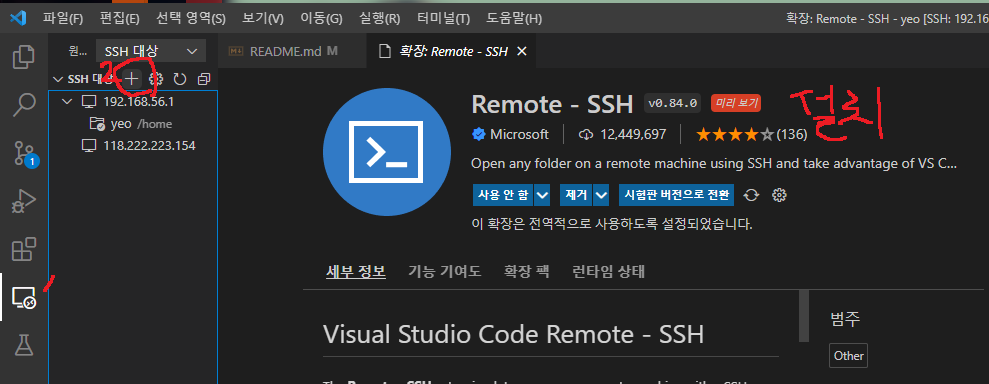
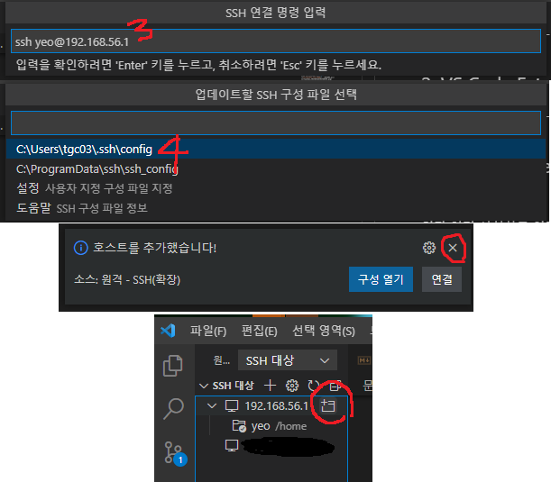

# 개발하기 전에...

<br>

ubuntu 직접 들어가서 하는 건 진짜진짜진짜 비추입니다. 개발 속도가 넘모나 느린 것입니다.  
그래서 ssh라는 방법으로 windows 환경에서 모든 것을 개발하는 방법을 소개합니다.<br><br>

## 1. ssh 설정
VirtualBox에서 네트워크 설정을 해야 합니다. 네트워크 연결까지 사전학습 때 다 했다고 가정하겠습니다.  
(ubuntu 가상컴퓨터를 끄고 난 뒤에 작업하시는 것을 권장합니다.)<br><br>


<br>

다음으로 ubuntu 내에서 터미널을 켜서 `sudo apt install openssh-server`를 수행합니다.

<br>

그리고 터미널에서 `windows에` ssh를 등록해야 합니다.  
```sh
ssh [사용자이름]@[접속ip]
```
명령어를 입력하면 다음과 같이 진행하면 됩니다<br>
(아마 대부분 192.168.56.1로 `ubuntu 비밀번호`로 로그인하면 될 겁니다.)<br><br>
> 비밀번호가 달라서 접속이 안된다면 ubuntu에서 `sudo passwd`로 ubuntu 비밀번호를 바꿔 봅니다.


<br>

여기까지 따라오셨다면 ssh 연결은 끗!  

<br>

## 2. VS Code Extension
- ### Windows
일단 이거 설치하고 여기까지 따라와 주세요.<br><br>


<br>



<br>

> 만약 `C:\Users\[사용자이름\.ssh\config`를 메모장으로 열고 봤을 때 중복되는 내용이 있다면 하나 삭제하는 것을 권장

그 다음에 `Linux -> [비밀번호 입력]`하면 VSCode로 ubuntu 환경에 들어오기 성공(할겁니다 아마도 ㅎ)  
그리고 반드시!! '이 ssh 환경'에서(LOCAL 아님아님!!) python, ROS extension 설치하시면 됩니다~  
이거 windows에다가 ssh 설정하면 파일을 VSCode 상에서 ubuntu랑 windows 와따리가따리 맘껏 가능해요!  
지금 이 README도 windows에서 작업하지만 실제 파일 위치는 ubuntu입니다.  
또한 git 명령어도 ubuntu에서 `sudo apt install git` 했다면 그대로 가능할겁니다.  
(근데 pull, push 할 때마다 아이디 비번 치는 게 좀 귀찮긴 해요.)  
혹시 안되는 거 있으면 질문 남겨주세요~  
 
<br>

## 추가사항
+ 스켈레톤 코드 여기다가 적용시켰어요! `catkin_make`로 build하면 될겁니다. `.gitignore`도 이에 따라 적용 완료했어용  
+ .bashrc 파일에서 마지막 줄에 `source ~/S07P21C109/devel/setup.bash`를 추가합니다.
+ scripts 안의 .py file들 모두 실행 권한을 부여하였습니다. scripts 안의 file을 실행하려면 예를 들어 다음과 같이 실행하시면 됩니다  
```sh
roslaunch rosbridge_server rosbridge_websocket.launch

# 다음 두 명령어 중 한 가지일 겁니다.
# 1 
rosrun ssafy_1 talker.py
# 2
roslaunch ssafy_1 talker_listener_1.launch
```

<br>

+ opencv 설치 방법  
```sh
python -m pip install --upgrade pip
pip install opencv-python==4.2.0.32
pip install opencv-contrib-python

# 여기까지 설치 다 했으면 VSCode에서 opencv snippets extension 설치 권장(안해도 되긴 함 ㅎ)
```

<br>

# 협업 툴 링크
### 1. [Notion](https://go-to-the-mars.notion.site/1d2471dd5a1f44b9b4c3bc9d5484f22f)