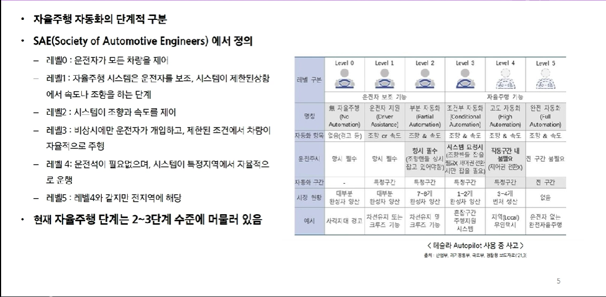
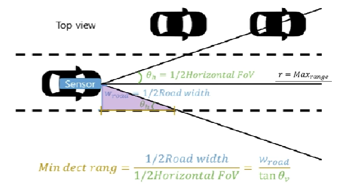
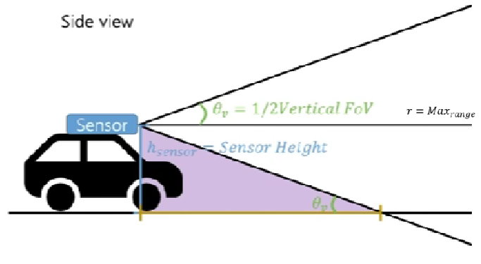
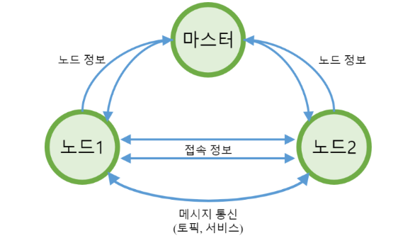
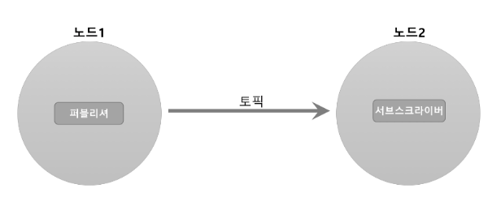
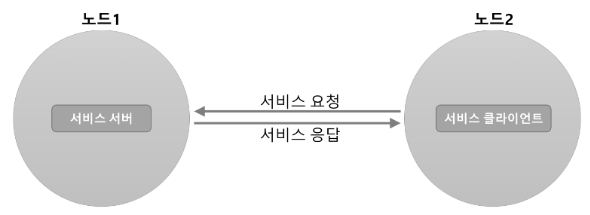
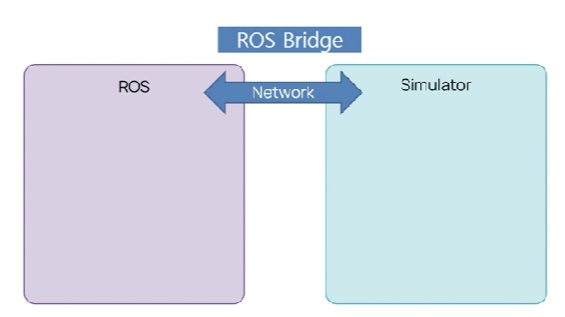
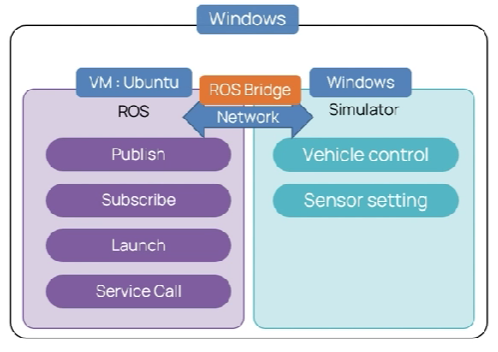

## 자율주행


#### 자율주행 정의




#### 센서 소개

- **Camera**
  - 시각적으로 보이는 정보를 찍기 때문에 다양한 정보를 얻을 수 있음
  - 딥 러닝을 통한 차량 및 보행자를 포함한 객체 인지
  - 비교적 낮은 단가로 자율주행 차량을 구성하기에 부담이 적음

  - 밤이나 악천후 등의 기상상태에 대해 품질이 떨어지기 쉬움

- **LiDAR**
  - 레이저 펄스를 쏘아서 반사되어 돌아오는 시간을 이용하여 거리를 인지

  - 작은 물체도 감지할 수 있을정도로 정밀도가 높음

  - 높은 에너지 소비와 가격대, 큰 외형

  - 악천후에 약함
- **Radar**
  - 전파를 매개체로 사물간 거리와 형태를 파악
  - LiDAR보다 정밀도가 떨어질 수 있음
  - 악천후에 강함
  - 소형화가 가능함
  - 작은 물체의 식별이 어려움

- **GPS**

  - 인공위성을 이용하여 현재위치를 알아내는 센서

  - 최소 4개 이상의 위성과 연결되어 있어야 위치 계산이 가능함

  - 경로계획에 사용하기 위해선 좌표값을 2D로 받아야함

    \-	WGS84 (3D) 좌표 > UTM(2D) 좌표 변환 필요

- **IMU** (Inertia Measurement Unit)
  - 관성 측정 장비라고 불림
  - 3축에 대한 각속도를 측정하는 자이로센서
  - 3축의 가속도를 측정하는 가속도 센서
  - x축 : Roll , y축 : pitch , z축 : yawn


#### 센서들의 범위

- Top view



- Side view



#### ROS 정의

- 로봇 소프트웨어를 개발하기 위한 소프트웨어 프레임워크
- 노드 간 데이터 통신을 제공

- 오픈소스를 기반

- 하나의 운영체제가 아니라 메타운영체제를 이용

  \-    메타운영체제 장점: 여러 운영체제간의  상호작용이 가능하다.

  

#### 왜 ROS를 사용하는가?

- 개발 시간 단축 

  \-	노드 간의 데이터를 주고 받을 때 프로토콜이 정의되어야하는데 ROS는 **topic**이라는 형태로 프로토콜이 정의되어 있으므로 개발 시간이 단축된다.

- node를 쉽게 모듈화할 수 있어서 다른 로봇에서도 패키지 재사용 가능하다.

- 데이터를 시작화 (rviz, tf_tree, plotiuggler 등) 해주는 툴들을 사용할 수 있다.

- ROS Wiki 에 문서와 소스코드를 쉽게 가져올 수 있다.

  

#### ROS 용어

- roscore : 마스터 노드 실행 (노드와 노드가 통신하기 위해선 반드시 마스터 노드가 있어야한다.)
- catkin_make : Catkin 빌드 시스템에 기반들 둔 빌드 ( 패키지가 새로 생겼거나 파일이 추가로 생겼을 때 build를 해줘야함)

- roscd package명 : 지정한 ROS 패키지의 디렉토리 위치로 이동
- rosrun package명 실행node명 : 패키지 안에 있는 노드 실행
- roslaunch : 여러 노드 실행 및 실행 옵션 설정


#### 메시지 통신의 과정




#### ROS 통신

- **토픽(Topic)**

  - 단방향, 비동기 통신

  - Publisher : Message 송신 , Scbsciber : Message 수신

  - 지속적으로 발생하는 송, 수신에 적합

  - 1:1 , 1:N , N:1 , N:N 모두 통신 가능 


  

  

- **서비스(Service)**

  - 양방향, 동기 통신
  - Service Client : Service 요청 , Service Server : Service 응답
  - 클라이언트 요청 후 서버에서 응답 
  - 요청과 응답이 끊기면 노드 종료

  


#### 개발 환경

- Package 생성

  ```bash
  $ mkdir catkin_ws/src	# 폴더 생성
  $ cd catkin_ws/src	
  
  # catkin_create_pkg : catkin 빌드 시스템으로 패키지 자동생성
  $ catkin_create_pkg 패키지이름 rospy std_msgs	# 패키지는 정석적으로 catkin_ws/src 폴더 안에 만듬.
  
  $ cd ~/catkin_ws
  $ catkin_make	# catkin_make를 할 때는 항상 catkin_ws 에서 해준다.
  
  # 환경 변수 설정
  $ source ~/catkin_ws/devel/setup.bash	# 항상 실행하고 싶으면 .bashrc 파일 안에 ~/catkin_ws/devel/setup.bash를 추가해준다.
  ```

  ```
  참고)
  1. 패키지를 새로 생성했으면 항상 catkin_ws에서 catkin_make로 build를 해줘야 한다.
  2. 패키지 안의 노드를 실행하고 싶으면 실행권한을 주어야 한다.
  	- 실행 권한 명령어 : chomod +x 노드이름( ex) asdf.py )
  ```

  

#### 시뮬레이터와 ROS 연동

- ROS와 시뮬레이터 연동 : **ROS bridge** 사용

  

  

- 시뮬레이터와 ROS의 환경

  

  


